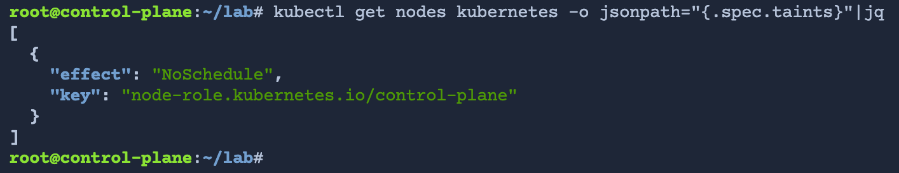
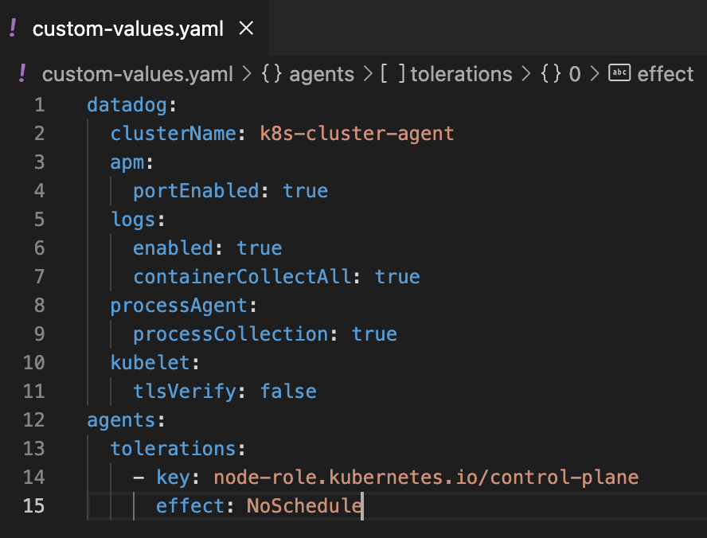

# Configure Helm chart
Helm is already installed in your lab environment. You can confirm this by running the following command:

```yaml
helm version
```

Add the Datadog Helm repository by running the following commands:
```yaml
helm repo add datadog https://helm.datadoghq.com
helm repo update
```
Click the IDE tab above the terminal and open the file **default-values.yaml**. This is a copy of the Helm chart values.yaml file that contains the default and optional settings for the Agent.

# Install Agent with helm chart

In the terminal, install the Datadog chart with the following command:

```yaml
helm install datadog-agent \
  -f custom-values.yaml \
  --set datadog.apiKey=$DD_API_KEY \
  datadog/datadog
```
This command names the release datadog-agent, and specifies the custom values file and key values.

# Customizando values.yaml

List the taints on the control plane node (named "kubernetes") by running the following command:

```yaml
kubectl get nodes kubernetes -o jsonpath="{.spec.taints}"|jq
```
The output should look like this:


The output confirms that there is indeed a NoSchedule taint on the control plane. To deploy an Agent on the control plane, you will need to add a toleration for it.

In the IDE, open custom-values.yaml. Add the following code to the bottom of the file:

```yaml
agents:
  tolerations:
    - key: node-role.kubernetes.io/control-plane
      effect: NoSchedule
```
The IDE will automatically save your changes. The file should look like the following:

This will indicate to the scheduler that this workload can run on the control plane despite the NoSchedule taint.

# Atualizando Agent 
```yaml
helm install datadog-agent \
  -f custom-values.yaml \
  --set datadog.apiKey=$DD_API_KEY \
  datadog/datadog
```