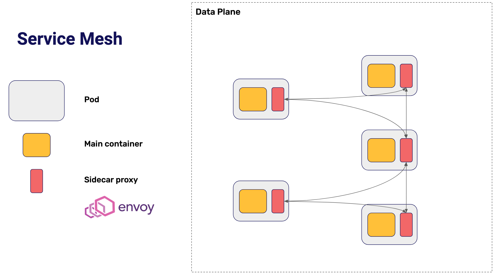
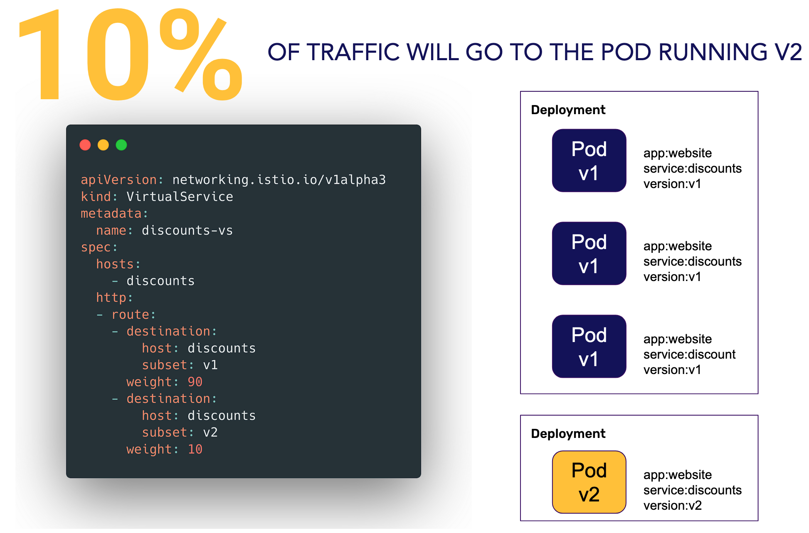

# Service Meshes

Os **Service Meshes** têm duas partes: o **data plane** e o **control plane**.

---

## Data Plane do Service Mesh

No **data plane**, cada Pod do cluster (dentro do service mesh) conterá um **proxy de rede** (o *Envoy* é uma solução popular para isso). Toda a comunicação entre os Pods acontece através desses proxies, **não diretamente pelo código da aplicação**.

Isso permite **delegar funcionalidades como criptografia** diretamente ao service mesh.



---

## Control Plane do Service Mesh

O **control plane** (com projetos como **Istio** ou **Linkerd**) melhora a usabilidade dos proxies de rede criando uma **linguagem de configuração amigável** para definir o comportamento desses proxies.

No Kubernetes, essa linguagem normalmente é implementada através de **Custom Resource Definitions (CRDs)**.

![img](./img/05-02_controlplane.png

---

## Service Mesh e Progressive Delivery

Como os Service Meshes fornecem uma linguagem poderosa para **gerenciar o tráfego entre Pods**, eles são ótimos para implementar técnicas de **Progressive Delivery**.

---

# Progressive Delivery com Istio

Para implementar **Progressive Delivery** no Kubernetes com **Istio**, o primeiro passo é expor o serviço usando os objetos:

- `Istio Gateway`
- `Istio VirtualService`

Esses dois CRDs juntos funcionam como um equivalente ao objeto `Ingress` do Kubernetes, com funcionamento semelhante.

![img](./img/05-03_istioservices.png

---

## Istio Gateway + VirtualService

- O **Istio Gateway** define os diferentes **URLs de destino** para o tráfego externo.
- O **VirtualService** mapeia esses **Gateways** para os **serviços internos** do cluster.

![img](./img/05-04_destinationrule.png

---

## Definindo Versões com DestinationRule

Para habilitar o Progressive Delivery, precisamos informar ao Istio que existem **várias versões** de um serviço.

Isso é feito através do recurso `DestinationRule`.



Exemplo: duas versões do serviço `discounts`:

```yaml
spec:
  host: discounts
  subsets:
    - name: v1
      labels:
        version: v1
    - name: v2
      labels:
        version: v2
